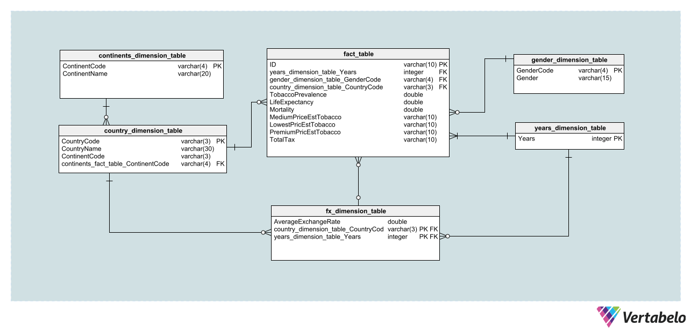
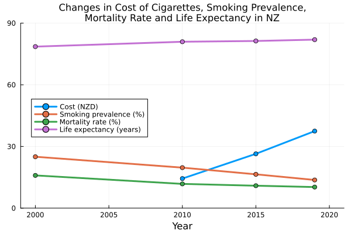
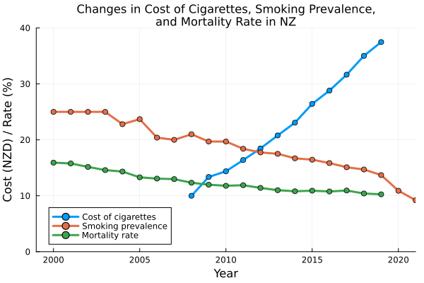

```{r setup, include=FALSE}
library(flexdashboard)
library(knitr)
library(DT)

library(ggplot2)
library(plotly)
library(tidyverse)
library(dplyr)
library(visdat)
library(rgdal)
library(leaflet)
library(viridis)
library(kableExtra)
library(htmlwidgets)
library(viridis)
```


```{r}
# main data

fact_table <- read.csv("fact-table.csv")
country_dimension_table <- read.csv("country_dimension_table.csv")
years_dimensional_table <- read.csv("years_dimensional_table.csv")
gender_dimension_table <- read.csv("gender_dimension_table.csv")
continent_dimensional_table <- read.csv("continent_dimensional_table.csv")
fx_dimensional_table <- read.csv("fx_dimension_table.csv")

```


```{r}
#information data
world_death <- read.csv("world_death.csv")
readable_name<-read.csv("readable_name.csv")
```


```{r}

##  Chloropleth Maps coding
# select what we need from fact table (ID, CountryCode, ContinentCode, LifeExpectancy and Mortality for 2019, Prevalence of Smoking, Prices and Tax for 2020 )
fact_table1 = fact_table %>% 
             filter(Year == 2020, GenderCode == "BTSX") %>% 
             select(CountryCode,  TobaccoPrevalence, MediumPriceEstTobacco, TotalTax )


# select what we need from fact table (year 2020, both genders, prevalence, price, taxes)
fact_table2 = fact_table %>% 
             filter(Year == 2019, GenderCode == "BTSX") %>% 
             select(ID, CountryCode,  LifeExpectancy, Mortality )


# join to one table
fact_table3 = fact_table2 %>%
           left_join(fact_table1 , by = "CountryCode")


fx_dimensional_table1 = fx_dimensional_table  %>% 
                        filter(Calendar.Year == 2020)
prices1 = fact_table3 %>%
           left_join(fx_dimensional_table1 %>% 
           select(CountryCode, average_fx), by = "CountryCode")
prices1 = prices1 %>% distinct(CountryCode, .keep_all = TRUE)


# join fact_table and country
prices1 = prices1 %>%
           inner_join(country_dimension_table %>% 
           select(CountryCode, CountryName, ContinentCode), by = "CountryCode")

prices1 = prices1 %>%
           inner_join(continent_dimensional_table %>% 
           select(ContinentCode, ContinentName), by = "ContinentCode")

# convert price into double
prices1 = prices1 %>% mutate(MediumPriceEstTobacco = as.numeric(MediumPriceEstTobacco))

# calculate price in USD
prices1 = prices1 %>% mutate(PriceUSD = round(MediumPriceEstTobacco / average_fx, digits =2))
prices1 <- prices1 %>%
  mutate(PriceUSD = ifelse(CountryCode == 'USA', MediumPriceEstTobacco, PriceUSD))


```


```{r}
world_spdf <- readOGR( 
  dsn= paste0(getwd(),"/GEODATA/") , 
  layer="TM_WORLD_BORDERS_SIMPL-0.3",
  verbose=FALSE
)
```


```{r}
prices1 = prices1 %>% distinct(CountryCode, .keep_all = TRUE)
# merge prices1 into spatial dataframe
world_spdf <- merge(world_spdf, prices1, by.x = "ISO3", by.y = "CountryCode", all.x = TRUE)
```


Background (Why smoking ?)
==============================


Column {data-width=1000}
-----------------------------------------------------------------------

### ***Smoking rank as a second leading cause of death worldwide.***
```{r}
#Convert the "Factor" variable to a factor
world_death$Factor <- factor(world_death$factor)

# Group the data by year and calculate the total deaths for each factor
grouped_data <- aggregate(deaths ~ Year + factor, data = world_death, sum)
top_factors <- grouped_data %>%
  group_by(factor) %>%
  summarize(TotalDeaths = sum(deaths)) %>%
  top_n(5, TotalDeaths) %>%
  pull(factor)
top5 <- grouped_data %>%
  filter(factor %in% top_factors)

# Create a line chart with a discrete color scale
plot1 <- ggplot(top5, aes(x = Year, y = deaths, color = factor)) +
  geom_line(size = 1) +
  geom_point(size = 2) +
  labs(
    title = "Factors Affecting Deaths Over the Years",
    x = "Year",
    y = "Total Deaths",
    color = "Factor"
  ) +
  theme_minimal()

# Convert the ggplot object to a plotly object
plotly_plot1 <- ggplotly(plot1)

# Show the interactive plot
plotly_plot1
```


Relational Data Model
=========================
Column {data-width=1000}
-----------------------------------------------------------------------
### Relational Data Model
```{r}
 
```


Missing Values
=========================

Column {data-width=500}
---------------------------------
As our data indicates, 49.3% of the data is missing. This is due to the fact that when we attempt to join tables, not all variables have data from the same year. As we expand our data during the process of joining and creating the fact table, missing values become evident in the fact table. Since our goal is to observe and analyze trends, these missing values are OK. 

### Missing counts in each feature
```{r}
set_plot_dimensions <- function(width_choice , height_choice) {
options(repr.plot.width=width_choice, repr.plot.height=height_choice)
}
missing_counts <- data.frame(feature = factor(names(fact_table)),
                    counts=sapply(fact_table, function(x) sum(is.na(x))))

set_plot_dimensions(12,6)
 ggplot(missing_counts,
       aes(x=reorder(feature, -counts), y=counts, fill=counts)) +
                                  geom_bar(stat="identity") +
                                  ggtitle("Missing counts in each feature") +
                                  xlab("Feature") + ylab("Missing count") +
                                  theme(axis.text.x=element_text(angle=45, hjust=1))+
                                  theme(text = element_text(size = 10))+
                                  scale_fill_continuous(trans = 'reverse')

                                  
```


Column {data-width=500}
-----------------------------------------------------------------------
### Missing Values 

```{r}


# Create the vis_miss plot
vis_miss(fact_table)


```


### Type of data
```{r}
vis_dat(fact_table)
```

Gender Trend
======================
Column {data-width=400}
-----------------------------------------------------------------------
 This Gender differences over time may relate  to cultural, physiological, and behavioral factors.


### Gender Differences

```{r}
library(highcharter)
library(webshot)

combined_data <- fact_table %>%
  left_join(country_dimension_table, by = "CountryCode")
final_combined_data <- combined_data %>%
  left_join(continent_dimensional_table, by = "ContinentCode")
filter_gender<- final_combined_data %>%
       filter(GenderCode != "BTSX")
 
# Calculate average values for tobacco prevalence and mortality by year and gender
avg_data <- filter_gender %>%
  group_by(Year, GenderCode) %>%
  summarize(Avg_TobaccoPrevalence = mean(TobaccoPrevalence, na.rm = TRUE),
            Avg_Mortality = mean(Mortality, na.rm = TRUE))

# Create a 3D scatterplot with different colors for males and females
# Create a Highcharter scatterplot with different colors for males and females
plot_gender <- hchart(avg_data, "scatter", hcaes(x = Year, y = Avg_TobaccoPrevalence, z = Avg_Mortality)) %>%
  hc_title(text = "Scatterplot of Year, TobaccoPrevalence, and Mortality") %>%
  hc_xAxis(title = list(text = "Year")) %>%
  hc_yAxis(title = list(text = "Tobacco Prevalence")) %>%
  hc_colorAxis(minColor = "#FF0000", maxColor = "#0000FF") %>%
  hc_tooltip(pointFormat = "Year: {point.x}<br>Avg Tobacco Prevalence: {point.y}<br>Avg Mortality: {point.z}") %>%
  hc_legend(enabled = TRUE)


plot_gender
```


Column {data-width=600}
-----------------------------------------------------------------------
### Smoking prevalanve and mortality rate both high in male than female.Over the years there is positive trend of declining both factors for both male and female.

```{r}
# Calculate average values for tobacco prevalence and mortality by year and gender
avg_data <- filter_gender %>%
  group_by(Year, GenderCode) %>%
  summarize(Avg_TobaccoPrevalence = mean(TobaccoPrevalence, na.rm = TRUE),
            Avg_Mortality = mean(Mortality, na.rm = TRUE))

# Create a 3D scatterplot with different colors for males and females
scatterplot <- plot_ly(data = avg_data, x = ~Year, y = ~Avg_TobaccoPrevalence, z = ~Avg_Mortality, 
                       text = ~paste("Year: ", Year, "<br>Avg Tobacco Prevalence: ", Avg_TobaccoPrevalence, 
                                      "<br>Avg Mortality: ", Avg_Mortality), type = "scatter3d", 
                       mode = "lines+markers", line = list(width = 1), color = ~GenderCode,
                      colors = c("FMLE" = "#FF0000", "MLE" = "#0000FF"))

scatterplot <- scatterplot %>%
  layout(
    scene = list(
      xaxis = list(title = "Year"),
      yaxis = list(title = "Tobacco Prevalence"),
      zaxis = list(title = "Mortality")
    ),
    title = "Scatterplot of Year, TobaccoPrevalence, and Mortality for both genders",
    showlegend = TRUE
  )

# Show the plot
scatterplot
```


smoking Prevalence (%)
=========================
Column {data-width=1000}
-----------------------------------------------------------------------

### smoking prevalence

```{r}
# Define a color palette 
color_palette <- colorNumeric("YlGn", domain = NULL)

# Define a color for NA values
na_color <- "lightgray"  # Change this to the color you prefer for NA values

# Create the leaflet map with popups
m <- leaflet(world_spdf) %>%
  addTiles() %>%
  setView(lat = 10, lng = 0, zoom = 2) %>%
  addPolygons(
    stroke = FALSE,
    fillOpacity = 0.5,
    smoothFactor = 0.5,
    color = ~color_palette(TobaccoPrevalence),
    fillColor = ~ifelse(is.na(TobaccoPrevalence), na_color, color_palette(TobaccoPrevalence)),
    popup = ~paste("<strong>Country:</strong>", NAME, "<br>",
                   "<strong>Smoking Prevalence:</strong>", TobaccoPrevalence, "%")
  ) %>%
  addLegend( 
    pal = color_palette, 
    values = ~PriceUSD, 
    opacity = 0.5, 
    title = "Prevalence of Smoking in % 2020", 
    position = "bottomleft")

m


```


Price in USD for Cigaratte
====================
Column {data-width=1000}
-----------------------------------------------------------------------


### Price in USD for cigaratte

```{r}
# Plot Worlmap for Prices in USD
# Numeric palette
# Define a color palette 
color_palette <- colorNumeric("YlGn", domain = NULL)

# Define a color for NA values
na_color <- "lightgray"  # Change this to the color you prefer for NA values

# Create the leaflet map
n <- leaflet(world_spdf) %>%
  addTiles() %>%
  setView(lat = 10, lng = 0, zoom = 2) %>%
  addPolygons(
    stroke = FALSE,
    fillOpacity = 0.5,
    smoothFactor = 0.5,
    color = ~color_palette(PriceUSD),
    fillColor = ~ifelse(is.na(PriceUSD), na_color, color_palette(PriceUSD)),
    popup = ~paste("<strong>Country:</strong>", NAME, "<br>",
                   "<strong>Price in USD:</strong>", PriceUSD)
  )  %>%
  addLegend( 
    pal=color_palette, 
    values=~PriceUSD, 
    opacity=0.5, 
    title = "Prices in USD for Cigarettes", 
    position = "bottomleft")

n
```


Europe 
================================

Column {data-width=500}
-----------------------------------------------------------------------
 Countries with higher tobacco prices tends to have low smoking prevalence, reduced mortality rate and longer life expectancy. However this trend doesn't hold true for all the countries.


### Tobacco prevalence/Price

```{r}
data <- prices1 %>% filter(ContinentCode == "EUR")
# Most basic bubble plot
bubble2 <- data %>%
  ggplot(aes(x=PriceUSD, y=TobaccoPrevalence,
             text = paste("Country Code: ", CountryName,
                          
                          "<br>Tax in %: ", TotalTax)))+

    geom_point(alpha=0.5, color="darkblue") +
    scale_size(range = c(.1, 10), name="Tax in %") +
    ylab("Prevalence of Smoking") +
    xlab("Price in USD") 
bubble2 <-ggplotly(bubble2)
bubble2

```


Column {data-width=500}
-----------------------------------------------------------------------


### Correlation between price and life expectancy

```{r}
library(plotly)

# dataset
#data <- prices1 %>% filter(ContinentCode == "EUR")

# Modify your ggplot code
bubble3 <- ggplot(data, aes(x = PriceUSD, y = LifeExpectancy, 
                            color = Mortality, 
                             text = paste("Country Code: ", CountryName, 
                                         "<br>Price in USD: ", PriceUSD, 
                                         "<br>Life Expectancy: ", LifeExpectancy, 
                                         "<br>Smoking Prevalence: ", TobaccoPrevalence, 
                                         "<br>Prob. of Dying: ", Mortality))) +
  geom_point(alpha = 0.7,size = 4) +
  scale_size(range = c(.1, 6), name = "Prevalence of Smoking") +
  scale_color_continuous(name = "Prob.of.Dying") + 
  ylab("Life Expectancy at Birth") +
  xlab("Price in USD") 

# Convert the ggplot to plotly
bubble3 <- ggplotly(bubble3, tooltip = c("text"))

bubble3

```


correlation (3D plot)
=====================

Column {data-width=1000}
-----------------------------------------------------------------------

If we look closer, for some countries High tobacco price coexist with high tobacco use. And Some nations with high smoking prevalence have low mortality rate and vice-versa.
There may  be some confounding factors play role.. such as GDP, Healthcare quality.

### ***In this plot- bigger the size of bubble , lower the tobacco prevalence***
```{r}

# Load the plotly library
library(plotly)


# Create a 3D scatter plot
scatter3d <- plot_ly(data, x = ~ TobaccoPrevalence , y = ~Mortality, z = ~PriceUSD, 
                     text = ~paste("Country Code: ", CountryName,
                                   "<br>Smoking Prevalence: ", TobaccoPrevalence, 
                                   "<br>Prob. of Dying: ", Mortality,
                                   "<br>PriceUSD: ", PriceUSD,
                                   "<br>LifeExpectancy: ", LifeExpectancy),
                     type = "scatter3d", mode = "markers",color = ~LifeExpectancy, size = ~TobaccoPrevalence,
                     marker = list(symbol = 'circle', sizemode = 'diameter'), sizes = c(30, 5))


scatter3d <- scatter3d %>% layout(scene = list(
    xaxis = list(title = "Mortality"),
    yaxis = list(title = "Tobacco Prevalence"),
    zaxis = list(title = "PriceUSD")
       
  ),
  title = "Scatter Plot of Mortality, Tobacco Prevalence, and PriceUSD",
  showlegend = TRUE
  )

# Show the 3D plot
scatter3d


```


NZ Trends (Julia)
=======================
Column {data-width=500}
-----------------------------------------------------------------------
### Changes in cost of Cigarattes, smoking prevalence,mortality and life expectancy in NZ
```{r}

```


Column {data-width=500}
-----------------------------------------------------------------------
### changes in cost of cigarattes, smoking prevalence and mortality rate in NZ
```{r}

```


Extra plot
==================================
Column {data-width=500}
-----------------------------------------------------------------------

### Price /prevalence/Mortality trends


```{r}
library(plotly)

# dataset
#data <- prices1 %>% filter(ContinentCode == "EUR")

# Modify your ggplot code
bubble3 <- ggplot(data, aes(x = Mortality, y = TobaccoPrevalence, 
                            color = PriceUSD, 
                             text = paste("Country Code: ", CountryName,
                                          
                                        
                                         "<br>Smoking Prevalence: ", TobaccoPrevalence, 
                                         "<br>Prob. of Dying: ", Mortality,
                                         "<br>PriceUSD: ", PriceUSD
                                         )))+
                                         
                                          
                                         
                                               
  geom_point(alpha = 0.7,size = 4) +
  scale_size(range = c(.1, 6), name = "Prevalence of Smoking") +
  scale_color_continuous(name = "PriceUSD") + 
  ylab("TobaccoPrevalence") +
  xlab("Mortality") 

# Convert the ggplot to plotly
bubble3 <- ggplotly(bubble3, tooltip = c("text"))

bubble3
```


Column {data-width=500}
-----------------------------------------------------------------------

### Tobacco prevalence /Gender


```{r}
boxplot2 <- ggplot(filter_gender,aes(x= GenderCode ,y= TobaccoPrevalence, fill= GenderCode)) + 
        geom_boxplot() +
        ggtitle("Tobaccoprevalence by gender")+
        theme(text = element_text(size = 12))+
       theme(axis.text.x=element_text(angle=45, hjust=1))+
        scale_fill_brewer(palette="Set1")
boxplot2<- ggplotly(boxplot2)
boxplot2
```

Readable Name(Fact table)
=============================
Column{data-width=1000}
-------------------------------

The data obtained from the WHO was bit difficult to read due to the complex indicator names. To address this issue, we have modified the indicator names to make them more easily readable. This file has been created to display the actual name of the data, along with its description and the newly revised, more readable name.


### Readable fact table

```{r}
datatable(readable_name)
```

